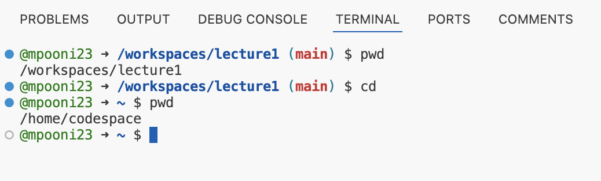
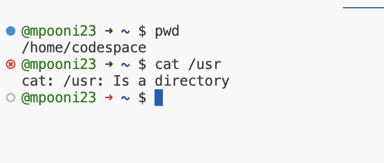
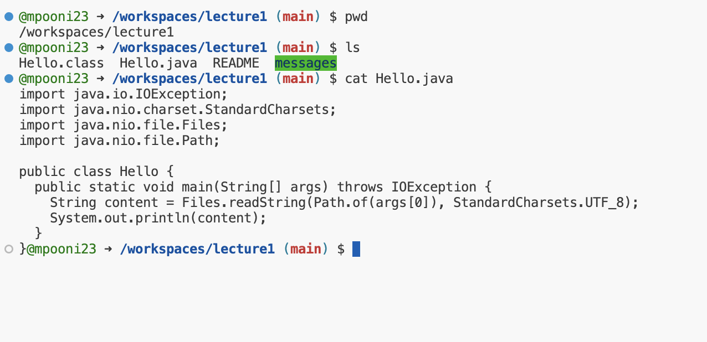

# Week 1 - Markdown, URL's, Paths, and the Filesystem

# **1. An example of using the cd command with no arguments**

When we cd without an argument we go to the users home directory. The working directory is /workspaces/lecture1 when the command was run. When you run the cd command without arguments the working directory would change to the home directory of the user, which is /home/codespace. The output is not an error.

# **2. An example of using the ls command with no arguments**

When we ls without an argument, it lists the contents in the current directory. The working directory is /workspaces/lecture1 when the command was run. When you run the ls command without arguments it lists the contents of the current working directory. The output is not an error.

# **3. An example of using the cat command with no arguments**

The working directory is /workspaces/lecture1 when the command was run. When you run the cat command without arguments it waits for user input and will echo whatever you type on the standard input. You have to exit by pressing control-d on the terminal. The output is not an error and the command echoes the contents typed on the standard input onto the standard output. This is an expected behavior. 

# **4. An example of using the cd command with a path to the directory as an argument**

When we cd using a path to a directory as an argument we get into that directory. The current working directory is /workspaces/lecture1. We do a cd to the /usr directory, the current working directory becomes /usr. The output is not an error.

# **5. An example of using the ls command with a path to the directory as an argument**

When we ls with a path to a directory as an argument, it prints the list of folders in the directory which we pass as an argument. The current working directory is /home/codespace. We do a ls of the /usr directory. It lists the contents of the /usr directory which includes the files and directories underneath it. The output is not an error.

# **6. An example of using the cat command with a path to the directory as an argument**

When we cat with a path to a directory as an argument, it throws an error. Since cat only prints contents of files and not contents of a directory. It throws an error saying "Is a directory". The current working directory is /home/codespace. We do a cat of the /usr directory it results in the error. The cat command will complain it is a directory. The output is an error.

# **7. An example of using the cd command with a path to a file as an argument**

When we cd with a path to a file as an argument it doesn't work since cd changes only to directories and not to files and as a result, we get an error saying "Not a directory". The current working directory is /workspaces/lecture1. When you run the cd command with path to a file such as Hello.java as an argument you will get an error. The current working directory remains the same as /workspaces/lecture1. The error would say the argument provided to cd is not a directory.

# **8. An example of using the ls command with a path to a file as an argument**

When we ls with a path to a file as an argument it just prints the name of the file as the output. The current working directory is /workspaces/lecture1. When you run the ls command with path to a file such as Hello.java as an argument, it will list the file name. The output is not an error.

# **9. An example of using the cat command with a path to a file as an argument**

When we cat with a path to a file as an argument, it prints the contents of the file which was passed as the argument. The current working directory is /workspaces/lecture1. When you run the cat command with path to a file as argument as in this case Hello.java it will list the contents of the file. The output is not an error.
