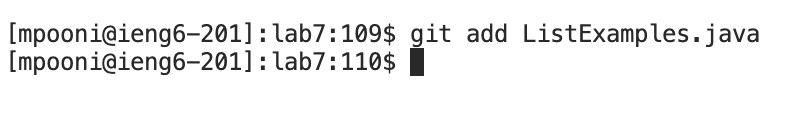

# Week 7 - Vim 

For this lab report we reproduce steps 4-9 shown below, take a screenshot, and write down exactly which keys were pressed to get to that step. 

Step 4. Log into ieng6

Step 5. Clone your fork of the repository from your Github account (using the SSH URL)

step 6.  Run the tests, demonstrating that they fail

step 7.  Edit the code file to fix the failing test

step 8. Run the tests, demonstrating that they now succeed

step 9.Commit and push the resulting change to your Github account (you can pick any commit message!)
 
# **4. Log into ieng6**


**Keys Pressed**: Press ```<Ctrl-R>``` and enter the search string ```ssh```. The ssh command previously used to log in into ieng6 is displayed on the command line.


**Keys Pressed**: The command found in the bash history is ```ssh mpooni@ieng6.ucsd.edu```. Press the ```<enter>``` key to log into the ieng6 account/computer. 

# **5. Clone your fork of the repository from your Github account (using the SSH URL)**


**Keys Pressed**: Press ```<Ctrl-R>``` and enter the search string ```git clone```. The git clone command used previously is displayed on the command line.


**Keys Pressed**: To complete this step, press ```<enter>``` key after the command displayed from bash history ```git clone git@github.com:mpooni23/lab7.git``` on the command prompt. The resulting screenshot shown above demonstrates the cloning of the forked repository.

# **6. Run the tests, demonstrating that they fail**


**Keys Pressed**: To complete this step, what I did was type ```ls``` followed by pressing the ```<enter>``` key on the command prompt to get the contents of the current directory. Then I typed ```cd l <tab> <enter>``` to get into the lab7 directory. This was followed by typing ```ls``` and pressing the ```<enter>``` key to get the contents of the lab7 directory. Then I typed ```bash test.sh``` followed by ```<enter>```to execute the bash script file test.sh. This resulted in a failure of one of the tests, as shown in the resulting screenshot.

# **7. Edit the code file to fix the failing test**


**Keys Pressed**: Type vim L <tab>.java<enter>


**Keys Pressed**: To complete this step, what I did was type ```vim  ListExamples.java``` on the command prompt followed by pressing the ```<enter>``` key. Then in the vim editor I pressed the ```k (up)``` key 6 times, and press ```l (right)``` key 11 times. Then I pressed the ```x (delete character)``` key to delete the 1 in index1 and it was followed by pressing the ```i (inserted before cursor)``` key to insert a 2 to change index1 to index2. Next, you need to type ```<ESC>   :wq   <ENTER>```  to save the changes.

# **8 Run the tests, demonstrating that they now succeed**


Then I typed ```bash test.sh``` followed by ```<enter>```to execute the bash script file test.sh. This resulted in all the tests succeeding, as shown in the resulting screenshot.

# **9 Commit and push the resulting change to your Github account (you can pick any commit message!)**




**Keys Pressed**: To complete this step, what I did was type ```git add L<tab>.java``` on the command prompt followed by pressing the ```<enter>``` key. This is followed by entering the command ```git commit -m "Changed list1 to list2"``` followed by pressing the ```<enter>``` key. Then I ran ```git push``` to push the changes to my github account.
